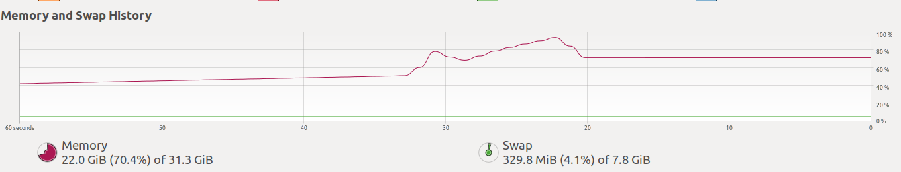

Memory Issues
-------------

1) a) Resizing using tf.image, b) saving as __tensor.numpy()__ to a list (resized_features_list)
   c) sklearn train_test_split, d) tf.data.Dataset.from_tensor_slices()
    - Time taken to create the tf training dataset: 502.32 s
    - del resized_features_list[:], x_train[:], x_test[:], x_valid[:] 
     does not do clear the RAM.
   
   
2) a) Resizing using tf.image, b) saving __tensor__ elements to a list (resized_features_list)
   c) sklearn train_test_split, d) tf.data.Dataset.from_tensor_slices()
    - Time taken to create the tf training dataset: 1.45 s
   

3) a) Using function (resizing_fn) to return a list with __tensor.numpy()__ as elements and passed to a variable
   b) Passing this variable to sklearn train_test_split, 
   c) tf.data.Dataset.from_tensor_slices()
    - Time taken to create the tf training dataset: 473.67 s

4) a) Using function (resizing_fn) to return a list with __tensor__ as elements and passed to a variable
   b) Passing this variable to sklearn train_test_split, 
   c) tf.data.Dataset.from_tensor_slices()
    - Time taken to create the tf training dataset: 1.40 s
   
5) a) Using function (resizing_fn) to return as a numpy array __(np.array(list(arrays)))__ 
      with __tensor.numpy()__ as elements and passed to a variable
   b) Passing this variable to sklearn train_test_split, 
   c) tf.data.Dataset.from_tensor_slices()
    - Time taken to create the tf training dataset: 2.58 s
    - Memory is twice compared to creation of the list. 
    - Running del x_train, x_test, x_valid, then gc.collect() clears the RAM
      bring the RAM level to same as methods 1-4. 
    - RAM from 8.3-15.1 GB after deleting x_train, x_test, x_valid and train_dataset
     
6) a) Using function (resizing_fn) to return as a numpy array __(np.array(list(tensors)))__ 
      with __tensor__ as elements and passed to a variable
    - returning __(np.array(list(tensor)))__ takes a long time!
    - RAM does not increase but CPU process continues at 100%
   
7) a) Same as __5__ but using __joblib Parallel__ for parallelization.
    - reduces the processing time to resize the images
    - RAM from 8.3-15.8 GB after deleting x_train, x_test, x_valid and train_dataset
    

#### Executing train_dataset.take(1) jumps the RAM by about 4-5 GB more or less same as the dataset size.
#### Max RAM usage is 20 GB before deleting the above arrays and datasets and running train_dataset.take(1) shown in the snapshot

